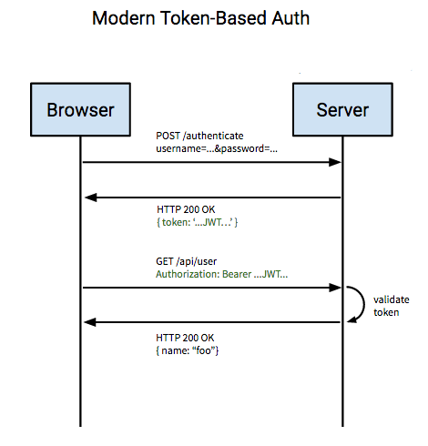

### 인증(Authentication)과 권한(Authorization)
인증(Authentication)은 보호된 리소스에 접근하는 대상, 즉 사용자에게 적절한 접근 권한이 있는지 확인하는 일련의 과정을 의미합니다.
이 때 보호된 리소스에 접근하는 대상(사용자)을 접근 주체(Principal)이라고 합니다.

권한(Authorization)은 인증 절차가 끝난 접근 주체(Principal)가 보호된 리소스에 접근 가능한지를 결정하는 것을 의미합니다.
이 때 권한을 부여하는 작업을 인가(Authorize)라고 합니다.

쉽게 생각한다면, 인증(Authentication)은 로그인을 하는 과정을 의미하고, 권한이 필요한 리소스에 접근하기 위해서 당연히 이러한 인증 과정을 거칩니다.
Spring Security에서는 이러한 인증 메커니즘을 간단하게 만들 수 있도록 다양한 옵션을 제공합니다.

### Spring Security 구조

1. 사용자가 로그인 정보와 함께 인증 요청 (Http Request)
2. AuthenticationFilter가 요청을 가로채어 인증 객체(UsernamePasswordAuthenticationToken) 생성
3. AuthenticationManager의 구현체인 ProviderManager에게 인증 객체(UsernamePasswordAuthenticationToken) 전달
4. AuthenticationProvider에 인증 객체(UsernamePasswordAuthenticationToken) 객체 전달
5. 데이터베이스에서 사용자 인증 정보를 가져오는 UserDetailService에서 사용자 정보(아이디)를 넘겨받음
6. 넘겨받은 사용자 정보를 통해 데이터베이스에서 찾은 사용자 정보인 UserDetails 객체 생성
(UserDetails 객체는 인증용 객체와 도메인용 객체를 분리하지 않고 인증용 객체에 상속해서 사용하기도 함)
7. AuthenticationProvider는 UserDetails를 넘겨받고 사용자 정보를 비교
8. 인증 완료 시 권한 등의 사용자 정보를 담은 Authentication 객체 반환
9. 최초의 AuthenticationFilter에 Authentication 객체 반환
10. Authentication 객체 SecurityContext에 저장

SecurityContextHolder는 세션 영역에 있는 SecurityContext에 Authentication 객체를 저장
세션에 사용자 정보를 저장한다는 것은 Spring Security가 전통적인 세션미- 쿠키 기반의 인증 방식을 사용한다는 것을 의미

### Spring Security Filter
Spring Security에는 다양한 필터체인이 존재하며, 이를 이용하여 커스터마이징을 할 수 있도록 도와줍니다.

|필터|설명|
|-----|---|
|SecurityContextPersistentFilter|SecurityContextRepository에서 SecurityContext를 가져와서 SecurityContextHolder에 주입하거나 반대로 저장하는 역할을 합니다.|
|LogoutFilter|logout 요청을 감시하며, 요청시 인증 주체(Principal)를 로그아웃 시킵니다.|
|UsernamePasswordAuthenticationFilter|login 요청을 감시하며, 인증 과정을 진행합니다.|
|DefaultLoginPageGenerationFilter|사용자가 별도의 로그인 페이지를 구현하지 않은 경우, 스프링에서 기본적으로 설정한 로그인 페이지로 넘어가게 합니다.|
|BasicAuthenticationFilter|HTTP 요청의 (BASIC)인증 헤더를 처리하여 결과를 SecurityContextHolder에 저장합니다.|
|RememberMeAuthenticationFilter|SecurityContext에 인증(Authentication) 객체가 있는지 확인하고 RememberMeServices를 구현한 객체 요청이 있을 경우, RememberMe를 인증 토큰으로 컨텍스트에 주입합니다.|
|AnonymousAuthenticationFilter|이 필터가 호출되는 시점까지 사용자 정보가 인증되지 않았다면 익명 사용자로 취급합니다.|
|SessionManagementFilter|요청이 시작된 이후 인증된 사용자인지 확인하고, 인증된 사용자일 경우 SessionAuthenticationStrategy를 호출하여 세션 고정 보호 매커니즘을 활성화 하거나 여러 동시 로그인을 확인하는 것과 같은 세션 관련 활동을 수행합니다.|
|ExceptionTranslationFilter|필터체인 내에서 발생되는 모든 예외를 처리합니다.|
|FilterSecurityInterceptor|AccessDecisionManager로 권한부여처리를 위임하고 HTTP 리소스의 보안 처리를 수행합니다.|

### JWT(Json Web Token)
JWT(Json Web Token)은 JSON 객체를 통해 안전하게 정보를 전송할 수 있는 웹 표준(RFC7519)입니다. 
JWT는 '.'을 구분자로 세 부분으로 구분되어 있는 문자열로 이루어져 있습니다. 각각 헤더는 토큰 타입과 해싱알고리즘을 저장하고, 내용은 실제로 전달할 정보, 서명에는 위변조를 방지하기 위한 값이 들어갑니다.

JWT는 JSON 객체를 암호화하여 만든 문자열의 값으로 위 변조가 어려운 정보입니다. 다른 토큰들과 달리 토큰 자체에 데이터를 가지고 있다는 특징을 지니고 있습니다.
JWT의 특징으로 인해 사용자의 인증 요청 시 필요한 정보를 전달하는 객체로 사용할 수 있습니다.

API 서버는 로그인 요청이 완료되면 클라이언트에게 회원을 구분할 수 있는 정보를 담은 JWT를 생성하여 전달합니다.
클라이언트는 이 JWT를 헤더에 담아 요청을 하게 됩니다. 권한이 필요한 요청이 있을 때, API 서버는 헤더에 담긴 JWT 값을 확인하고 권한이 있는 사용자인지 확인 후 리소스를 제공합니다.

JWT는 세션-쿠키 기반의 로그인이 아닌 세션이 유지되지 않는 다중 서버 환경에서 로그인을 유지할 수 있고 한번의 로그인으로 유저정보를 공유하는 여러 도메인에서 사용할 수 있습니다.
회원을 구분하는 정보가 담긴 곳은 Payload라고 하며 이곳에 담기는 정보의 한 '조각'을 Claim이라고 합니다.
Claim은 name-value 한 쌍으로 이루어져 잇으며 여러개의 Claim을 넣을 수 있습니다.

https://velog.io/@city7310/%EB%B0%B1%EC%97%94%EB%93%9C%EA%B0%80-%EC%9D%B4%EC%A0%95%EB%8F%84%EB%8A%94-%ED%95%B4%EC%A4%98%EC%95%BC-%ED%95%A8-5.-%EC%82%AC%EC%9A%A9%EC%9E%90-%EC%9D%B8%EC%A6%9D-%EB%B0%A9%EC%8B%9D-%EA%B2%B0%EC%A0%95
